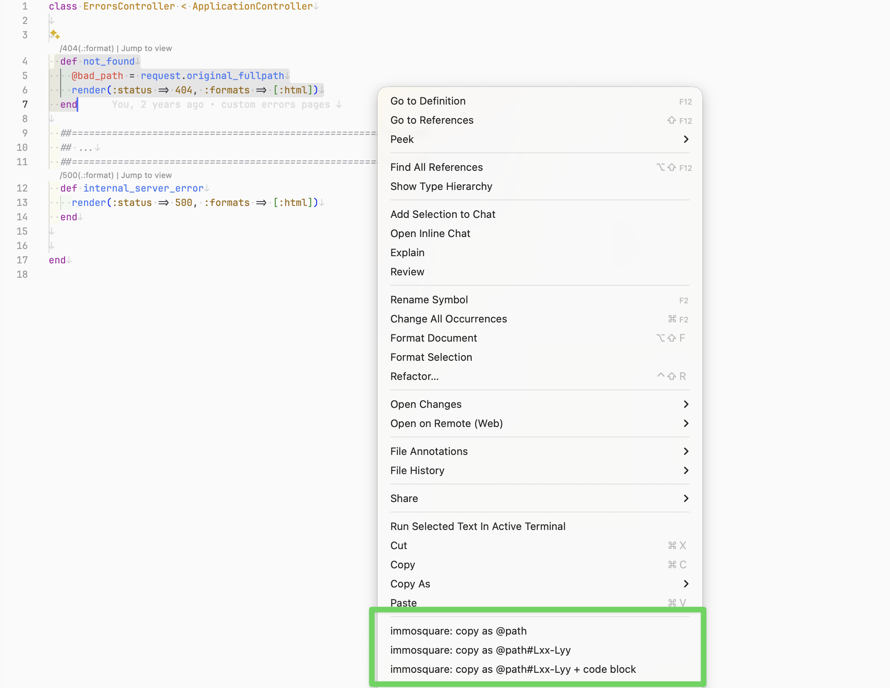

# immosquare-vscode

VSCode extension to enhance your development workflow with:
- [Code Cleaning](#code-cleaning)
- [Browser Reloading](#browser-reloading)
- [Copy as LLM Reference](#copy-as-llm-reference)
- [Procfile Language Support](#procfile-language-support)
- [ERB snippets](#erb-snippets)
- [Ruby snippets](#ruby-snippets)
- [Custom keyboard shortcuts](#keyboard-shortcuts)

## Code Cleaning

The extension automatically runs the [immosquare-cleaner](https://github.com/immosquare/immosquare-cleaner) gem on saved files to clean your code (Rubocop, Eslint, Prettier, etc.).

**Requirement**: The `immosquare-cleaner` gem must be installed in your project.

## Browser Reloading

The extension automatically reloads browsers when you save specific files.

> **macOS only.** Browser reload uses AppleScript via `osascript`; it is silently skipped on Linux/Windows.

### Configuration

```json
{
  "immosquare-vscode.reloadableExtensions": [".js", ".js.erb", ".html", ".html.erb"],
  "immosquare-vscode.browsers": ["chrome", "firefox", "safari"],
  "immosquare-vscode.urlPattern": "immosquare.me"
}
```

- `reloadableExtensions`: File extensions to watch (default: [".js", ".js.erb", ".html", ".html.erb"]). Set to `false` to disable.
- `browsers`: Browsers to reload (allowed: `chrome`, `firefox`, `safari` — default: ["chrome"])
- `urlPattern` (optional): Pattern to filter URLs to reload, only reloads tabs containing this pattern

## Copy as LLM Reference

Three right-click commands to copy file references in a format understood by Claude Code, Codex, Gemini CLI, and other LLM-based assistants.



Given the following selection in `app/controllers/errors_controller.rb` (lines 4 to 7):

```ruby
def not_found
  @bad_path = request.original_fullpath
  render(:status => 404, :formats => [:html])
end
```

Each command produces:

**`immosquare: copy as @path`**

```
@app/controllers/errors_controller.rb
```

**`immosquare: copy as @path#Lxx-Lyy`**

```
@app/controllers/errors_controller.rb#L4-L7
```

**`immosquare: copy as @path#Lxx-Lyy + code block`**

````
@app/controllers/errors_controller.rb#L4-L7
```ruby
def not_found
  @bad_path = request.original_fullpath
  render(:status => 404, :formats => [:html])
end
```
````

The two line-range commands (`#Lxx-Lyy` and `+ code block`) handle multi-cursor selections, producing one reference per cursor. All three commands are hidden from the command palette — they are intentionally context-menu-only to keep it uncluttered.

## Procfile Language Support

Provides syntax highlighting and `#` line-comment support for `Procfile`, `Procfile.dev`, and `Procfile.local`.

## ERB Snippets
| Prefix        | Description       |
| ------------- | ----------------- |
| `ct`          | content_tag       |
| `er`          | print ruby tag    |
| `pc`          | print comment tag |
| `pe`          | print equal tag   |
| `if`          | ERB if / end      |
| `else`        | ERB else tag      |
| `elsif`       | ERB elsif tag     |
| `end`         | ERB end tag       |
| `lt`          | ERB link tag      |
| `it`          | Image tag         |
| `il`          | immosquare logger |
| `partial`     | partial           |
| `simple_form` | simple_form       |

## Ruby Snippets
| Prefix      | Description                              |
| ----------- | ---------------------------------------- |
| `il`        | immosquare logger                        |
| `bc`        | block comment with `##====##` separators |

## Keyboard Shortcuts

| Keybinding (linux/mac)         | Command                                  | When                                  |
| ------------------------------ | ---------------------------------------- | ------------------------------------- |
| `ctrl+9` / `cmd+9`             | editor.action.outdentLines               | editorTextFocus && !editorReadonly    |
| `ctrl+0` / `cmd+0`             | editor.action.indentLines                | editorTextFocus && !editorReadonly    |
| `shift+ctrl+f` / `shift+cmd+f` | search.action.openNewEditor              |                                       |
| `ctrl+k` / `cmd+k`             | workbench.output.action.clearOutput      |                                       |
| `ctrl+k` / `cmd+k`             | workbench.action.terminal.clear          |                                       |
| `ctrl+r` / `cmd+r`             | editor.action.smartSelect.expand         | editorTextFocus                       |
| `shift+ctrl+r` / `shift+cmd+r` | editor.action.smartSelect.shrink         | editorTextFocus                       |
| `ctrl+3` / `cmd+3`             | editor.action.insertSnippet              | editorHasSelection                    |


## Testing
- To test the extension, tap fn+f5 to open a new window with the extension loaded.
