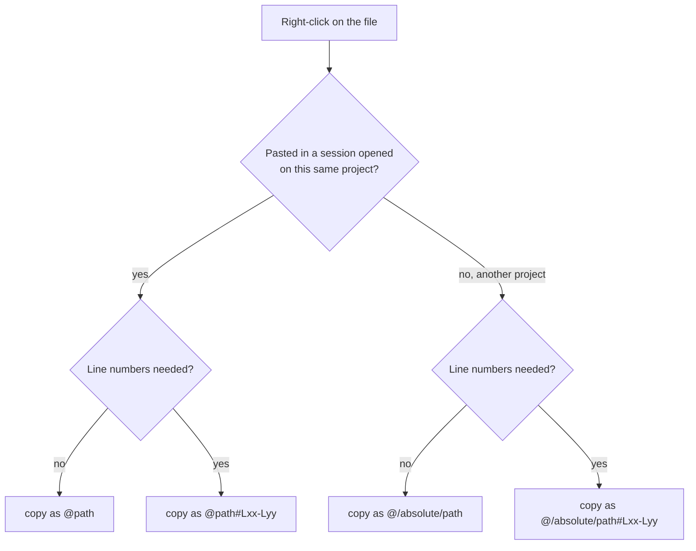

# immosquare-vscode

immosquare-vscode is a VSCode extension that enhances your development workflow: it cleans code on save, reloads browsers on save, copies file references for LLM assistants, ships ERB and Ruby snippets, adds Procfile syntax highlighting, and binds a set of custom keyboard shortcuts. Code cleaning requires the `immosquare-cleaner` gem in your project, and browser reloading is macOS only.

- [Code cleaning on save with immosquare-cleaner](#code-cleaning-on-save-with-immosquare-cleaner)
- [Browser reloading on save (macOS only)](#browser-reloading-on-save-macos-only)
- [Copy as LLM reference commands for Claude Code, Codex and Gemini CLI](#copy-as-llm-reference-commands-for-claude-code-codex-and-gemini-cli)
- [ERB and Ruby snippets, and Procfile syntax highlighting](#erb-and-ruby-snippets-and-procfile-syntax-highlighting)
- [Keyboard shortcuts added by immosquare-vscode](#keyboard-shortcuts-added-by-immosquare-vscode)
- [Testing the extension locally](#testing-the-extension-locally)

## Code cleaning on save with immosquare-cleaner

The extension automatically runs the [immosquare-cleaner](https://github.com/immosquare/immosquare-cleaner) gem on saved files to clean your code (Rubocop, Eslint, Prettier, etc.).

**Requirement**: The `immosquare-cleaner` gem must be installed in your project.

## Browser reloading on save (macOS only)

The extension automatically reloads browsers when you save specific files.

> **macOS only.** Browser reload uses AppleScript via `osascript`; it is silently skipped on Linux/Windows.

Three settings drive which files trigger a reload, which browsers are reloaded, and which tabs are concerned:

```json
{
  "immosquare-vscode.reloadableExtensions": [".js", ".js.erb", ".html", ".html.erb"],
  "immosquare-vscode.browsers": ["chrome", "firefox", "safari"],
  "immosquare-vscode.urlPattern": "immosquare.me"
}
```

- `reloadableExtensions`: File extensions to watch (default: [".js", ".js.erb", ".html", ".html.erb"]). Set to `false` to disable.
- `browsers`: Browsers to reload (allowed: `chrome`, `firefox`, `safari` — default: ["chrome"])
- `urlPattern` (optional): Pattern to filter URLs to reload, only reloads tabs containing this pattern

## Copy as LLM reference commands for Claude Code, Codex and Gemini CLI

Four right-click commands copy a file reference in a format understood by Claude Code, Codex, Gemini CLI and other LLM-based assistants.

Right-click inside the editor to get all four, grouped together at the bottom of the menu. Right-click a file or a folder in the Explorer (file tree) to get the two plain-path ones, which there accept a multi-selection and emit one reference per item, joined by a space. None of the four appears in the command palette, on purpose — they stay context-menu-only so the palette is not cluttered by commands that need a file under the cursor.

Two questions decide which of the four to reach for: whether the reference has to survive being pasted somewhere else, and whether it has to carry line numbers.


```mermaid
flowchart TD
    A["Right-click on the file"] --> B{"Pasted in a session opened<br>on this same project?"}
    B -- yes --> C{"Line numbers needed?"}
    B -- "no, another project" --> D{"Line numbers needed?"}
    C -- no --> E["copy as @path"]
    C -- yes --> F["copy as @path#Lxx-Lyy"]
    D -- no --> G["copy as @/absolute/path"]
    D -- yes --> H["copy as @/absolute/path#Lxx-Lyy"]
```

Given this selection in `app/controllers/errors_controller.rb`, lines 4 to 7:

```ruby
def not_found
  @bad_path = request.original_fullpath
  render(:status => 404, :formats => [:html])
end
```

Each command produces:

| Command                                       | Clipboard                                                       |
| --------------------------------------------- | --------------------------------------------------------------- |
| `immosquare: copy as @path`                   | `@app/controllers/errors_controller.rb`                         |
| `immosquare: copy as @path#Lxx-Lyy`           | `@app/controllers/errors_controller.rb#L4-L7`                   |
| `immosquare: copy as @/absolute/path`         | `@/Users/you/Sites/myapp/app/controllers/errors_controller.rb`   |
| `immosquare: copy as @/absolute/path#Lxx-Lyy` | `@/Users/you/Sites/myapp/app/controllers/errors_controller.rb#L4-L7` |

The workspace-relative form is the short one, and it is the right one inside a session opened on that project. The absolute form is the one that survives a move: pasted into a session opened on another project, a relative path resolves to nothing — or, worse, to a different file that happens to sit at the same place in the tree.

The two `#Lxx-Lyy` commands handle multi-cursor selections and produce one reference per cursor, joined by a space. A triple-click full-line selection ends at column 0 of the following line; the range snaps back so the reference names the line actually selected.

## Opening a file in the default browser

`immosquare: open in browser` hands the selected files to the operating system, which opens each one with the application registered for its type — Chrome for `.html` on a standard setup. The command sits on both the editor and the Explorer context menus, and the Explorer one accepts a multi-selection, so a batch of generated mockups opens in a single gesture.

It exists to remove the Reveal in Finder detour: an `.html` mockup written under `tmp/` otherwise has to travel through Finder before it reaches a browser.

Asking the operating system rather than naming a browser is what keeps the command correct the day the default browser changes. The flip side is that it follows the *file type* association and not the "default browser" setting: on a machine where `.html` is mapped to an editor, the file reopens in that editor. Outside macOS the command falls back to `vscode.env.openExternal`, which defers to the same mechanism.

## ERB and Ruby snippets, and Procfile syntax highlighting

The extension provides syntax highlighting and `#` line-comment support for `Procfile`, `Procfile.dev`, and `Procfile.local`, plus two sets of snippet prefixes.

The ERB snippets expand to these tags and helpers:

| Prefix        | Description           |
| ------------- | --------------------- |
| `ct`          | content_tag           |
| `er`          | ruby tag              |
| `pc`          | comment tag           |
| `pe`          | print tag             |
| `if`          | ERB if / end          |
| `else`        | ERB else tag          |
| `elsif`       | ERB elsif tag         |
| `end`         | ERB end tag           |
| `each`        | ERB each / end        |
| `yield`       | ERB yield             |
| `t`           | ERB i18n translation  |
| `lt`          | ERB link tag          |
| `it`          | Image tag             |
| `il`          | immosquare logger     |
| `partial`     | partial               |
| `simple_form` | simple_form           |

The Ruby snippets cover logging and block comments:

| Prefix      | Description                              |
| ----------- | ---------------------------------------- |
| `il`        | immosquare logger                        |
| `bc`        | block comment with `##====##` separators |

## Keyboard shortcuts added by immosquare-vscode

The extension binds these keys, in their linux and mac variants:

| Keybinding (linux/mac)         | Command                                  | When                                  |
| ------------------------------ | ---------------------------------------- | ------------------------------------- |
| `ctrl+9` / `cmd+9`             | editor.action.outdentLines               | editorTextFocus && !editorReadonly    |
| `ctrl+0` / `cmd+0`             | editor.action.indentLines                | editorTextFocus && !editorReadonly    |
| `shift+ctrl+f` / `shift+cmd+f` | search.action.openNewEditor              |                                       |
| `ctrl+k` / `cmd+k`             | workbench.output.action.clearOutput      |                                       |
| `ctrl+k` / `cmd+k`             | workbench.action.terminal.clear          |                                       |
| `ctrl+r` / `cmd+r`             | editor.action.smartSelect.expand         | editorTextFocus                       |
| `shift+ctrl+r` / `shift+cmd+r` | editor.action.smartSelect.shrink         | editorTextFocus                       |
| `ctrl+3` / `cmd+3`             | editor.action.insertSnippet              | editorHasSelection                    |

The `ctrl+3` / `cmd+3` binding is the only one that carries an argument: it passes the snippet `"#{$TM_SELECTED_TEXT}"` to `editor.action.insertSnippet`, which wraps the current selection in a Ruby string interpolation — `name` becomes `"#{name}"`. That is why it is bound to `editorHasSelection`: with no selection it would only insert an empty `"#{}"`.

## Testing the extension locally

To test the extension, tap fn+f5 to open a new window with the extension loaded.

## Regenerating the extension icon from the immosquare wordmark

`icon.png` is never edited by hand. It is rendered from `icon.svg`, the immosquare wordmark, so a brand change is replayed with one command instead of a round trip through a design tool.

The rendering flattens the wordmark onto an opaque white square, and that opacity is the point. The wordmark is red and dark grey on a transparent background: on the dark background the Marketplace and the VS Code extensions panel use for most users, everything but the red `immo` disappears. An opaque background makes the icon read identically in both themes.

Replace `icon.svg` with the current wordmark, then run this from the repository root:

```bash
{
  echo '<style>html,body{margin:0;padding:0}body{width:256px;height:256px;background:#fff;display:flex;align-items:center;justify-content:center}svg{width:224px;height:auto}</style>'
  cat icon.svg
} > icon.html
"/Applications/Google Chrome.app/Contents/MacOS/Google Chrome" --headless --disable-gpu \
  --window-size=256,256 --virtual-time-budget=4000 \
  --screenshot=icon.png "file://$PWD/icon.html"
rm icon.html
```

The SVG is concatenated into the page rather than pointed at with an image tag, and that detail is load-bearing. The Marketplace validator scans this README for image references **without skipping fenced code blocks**, and it refuses references to SVG files. An image tag whose source ends in `.svg` — written anywhere in this file, example or not, code block or not — is read as a real reference and gets the upload rejected with `Error processing SVG reference in file '/extension/README.md'`. Keep every mention of the source file in prose or inline code, never inside a tag.

Check the output before committing it:

```bash
sips -g pixelWidth -g pixelHeight -g hasAlpha icon.png
```

It must report 256 × 256 and `hasAlpha: no`. The Marketplace requires at least 128 × 128; 256 keeps the icon crisp on hidpi displays. `icon.svg` is listed in `.vscodeignore`, so only the rendered PNG ships in the package.

## Publishing a new release of immosquare-vscode to the VS Code Marketplace

The Marketplace refreshes the icon, the README and the changelog only when a new version is published. Editing any of them in the repository changes nothing for users until this procedure runs.

1. Bump `version` in `package.json`
2. Add the matching entry at the top of `CHANGELOG.md`
3. Commit `package.json` and `CHANGELOG.md`
4. Publish:

   ```bash
   vsce publish
   ```

   `vsce` packages and uploads in one step. To inspect the package first without publishing, run `vsce package`, which writes `immosquare-vscode-<version>.vsix` in the repository root. Those files are covered by `*.vsix` in `.gitignore` and can be deleted at any time.

5. Check the published listing at [marketplace.visualstudio.com](https://marketplace.visualstudio.com/items?itemName=immosquare.immosquare-vscode)
